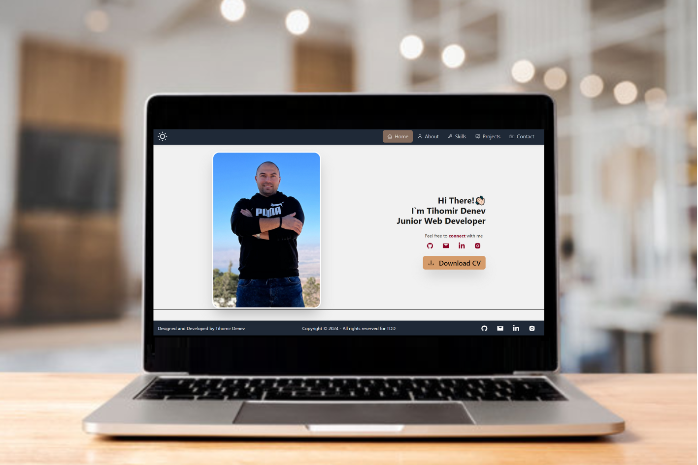

<h2 align="center">
  Welcome to My Portfolio Website! <br/>
  <a href="https://portfolio-tihomirdenevs-projects.vercel.app/" target="_blank">TDD PortFolio</a>
</h2>
<div align="center">

</div>

# 📝 Description

- This project is a comprehensive showcase of my skills, projects, and experiences as a web developer. It serves as a digital resume and a professional platform to present my work to potential employers and collaborators. The website is designed to provide a detailed overview of my capabilities, achievements, and professional journey.
  <br/><br/>

# 🗃️ Technologies Used

- Languages:  

- Frameworks/Libraries:     

- Browsers:     
  <br/><br/>

# 💡 Features

- **Home**
  - A downloadable and printable version of my CV/resume, providing a concise summary of my skills, experiences, and education.
- **About Me**
  - A brief introduction to who I am, my background, and my journey into web development.
  - Highlights of my core values, work philosophy, and what drives my passion for coding.
  - Additional sections highlighting certifications, awards, and relevant extracurricular activities.
- **Skills**
  - A detailed list of my technical skills, including programming languages, frameworks, tools, and technologies I am proficient in.
- **Projects**
  - An extensive portfolio of my projects, showcasing both personal and professional work.
  - Each project includes a description, technologies used, and links to live demos or repositories.
- **Contact**

  - Various ways to get in touch with me, including email address, and links to my social media profiles.
  - Information on my availability for new projects, collaborations, or job opportunities.

  <br/>

# ✅ Getting Started

To install and run the project, follow these steps:

1. Clone the [Portfolio _GitHub repository_](https://github.com/TihomirDenev/My-PortFolio) locally:

```bash
git clone https://github.com/TihomirDenev/My-PortFolio.git
```

2. Navigate to the project directory:

```bash
cd MyPortfolio
```

3. Install project dependencies:

```bash
npm install
```

4. To run the project, use the following command:

```bash
npm run dev
```

5. Open localhost link in browser to view web-platform.

<br/>

# 🛠 Technologies Used

- `HTML`
- `JavaScript`
- `React`
- `Tailwind CSS`
- `Daisy UI`

<br />

# 📲 Information and Deployment

- This site is hosted on Vercel, which provides powerful hosting and serverless functions for static and dynamic websites. You can view the live site here: [My Portfolio](https://portfolio-tihomirdenevs-projects.vercel.app/).

<br />

# 📇 License

- This project is licensed under the [MIT License](https://opensource.org/licenses/MIT).
